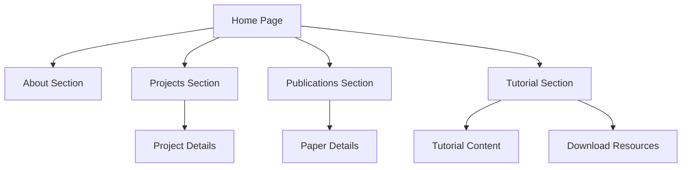

## 1. Product Overview

This is a personal academic webpage showcasing research profile, ongoing projects, publications, and educational content in neuroimaging. The webpage serves as a professional portfolio for academics to present their work, share knowledge, and establish credibility in their field.

Target audience includes fellow researchers, students, potential collaborators, and academic institutions seeking to understand the researcher's expertise and contributions.

## 2. Core Features

### 2.1 User Roles

| Role | Registration Method | Core Permissions |
|------|---------------------|------------------|
| Site Visitor | No registration required | View all public content, download resources |
| Site Owner | Admin access via authentication | Manage all content, update projects/papers |

### 2.2 Feature Module

The academic webpage consists of the following main pages:

1. **Home page**: Personal introduction, academic profile, navigation to sections
2. **Projects page**: Ongoing research projects with descriptions and progress
3. **Publications page**: List of published papers with links and citations
4. **Neuroimaging Tutorial page**: Educational content about neuroimaging techniques

### 2.3 Page Details

| Page Name | Module Name | Feature description |
|-----------|-------------|---------------------|
| Home page | Hero section | Display academic name, title, and brief introduction with professional headshot |
| Home page | Navigation bar | Sticky navigation with smooth scrolling to sections |
| Home page | About section | Detailed academic background, research interests, and contact information |
| Projects page | Project cards | Grid layout showcasing current research projects with titles, descriptions, and status |
| Projects page | Project details | Expandable sections for project methodology, collaborators, and expected outcomes |
| Publications page | Paper list | Chronological list of publications with proper academic formatting |
| Publications page | Paper metadata | Display authors, journal/conference, year, DOI links, and citation information |
| Publications page | Download links | Direct links to PDFs or publisher websites for paper access |
| Tutorial page | Tutorial sections | Organized lessons about neuroimaging concepts and techniques |
| Tutorial page | Interactive elements | Code examples, images, and step-by-step guides |
| Tutorial page | Resource downloads | Provide datasets, code samples, and supplementary materials |

## 3. Core Process

### Visitor Flow
1. Visitor arrives at homepage and views introduction
2. Visitor navigates to projects section to view ongoing research
3. Visitor explores publications to understand research contributions
4. Visitor accesses tutorial content for educational purposes
5. Visitor downloads relevant resources or contacts researcher

### Site Owner Flow
1. Owner logs into admin interface
2. Owner updates project information and progress
3. Owner adds new publications with proper citations
4. Owner modifies tutorial content and resources
5. Owner reviews site analytics and visitor engagement

## 4. User Interface Design

### 4.1 Design Style

- **Primary colors**: Professional blue (#1e40af) and white background
- **Secondary colors**: Light gray (#f3f4f6) for sections, dark gray (#374151) for text
- **Button style**: Rounded corners with subtle shadows, hover effects
- **Font**: Clean, academic-appropriate sans-serif (Inter or similar)
- **Font sizes**: 16px body text, 32px headings, 20px subheadings
- **Layout style**: Card-based sections with consistent spacing
- **Icons**: Academic-themed icons using Feather or similar minimalist set

### 4.2 Page Design Overview

| Page Name | Module Name | UI Elements |
|-----------|-------------|-------------|
| Home page | Hero section | Centered layout with profile image, name in 48px font, title in 24px, brief bio in 18px |
| Home page | Navigation | Sticky top nav with smooth scroll, active section highlighting, mobile hamburger menu |
| Projects page | Project cards | Responsive grid (3 columns desktop, 1 column mobile), card shadows, status badges |
| Publications page | Paper list | Clean list format with alternating row colors, citation formatting, external link icons |
| Tutorial page | Content sections | Left sidebar navigation, main content area with code syntax highlighting, image galleries |

### 4.3 Responsiveness

- **Desktop-first design**: Optimized for 1920x1080 and larger displays
- **Mobile adaptation**: Breakpoints at 768px (tablet) and 480px (mobile)
- **Touch optimization**: Larger tap targets on mobile, swipe-friendly carousels
- **Performance**: Lazy loading for images, optimized assets for mobile data usage