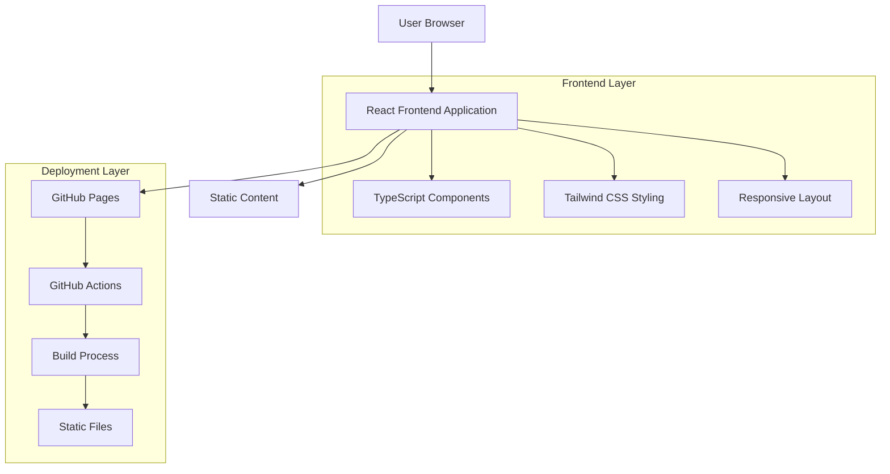

## 1. Architecture Design



## 2. Technology Description

- **Frontend**: React@18 + TypeScript@5 + Tailwind CSS@3
- **Build Tool**: Vite@5
- **Deployment**: GitHub Pages with GitHub Actions
- **Package Manager**: npm
- **Version Control**: Git

## 3. Route Definitions

| Route | Purpose |
|-------|---------|
| / | Homepage with introduction and navigation |
| /projects | Projects section showcasing ongoing research |
| /publications | Publications list with academic formatting |
| /tutorials | Neuroimaging educational content |
| /#about | About section anchor (smooth scroll) |

## 4. Component Structure

### 4.1 Core Components

```typescript
// Main App Component
interface AppProps {
  content: SiteContent;
}

// Navigation Component
interface NavigationProps {
  sections: Section[];
  currentSection: string;
}

// Project Card Component
interface ProjectCardProps {
  title: string;
  description: string;
  status: 'ongoing' | 'completed' | 'planned';
  collaborators?: string[];
  timeline?: string;
}

// Publication Card Component
interface PublicationCardProps {
  title: string;
  authors: string[];
  journal: string;
  year: number;
  doi?: string;
  pdfUrl?: string;
  abstract?: string;
}

// Tutorial Section Component
interface TutorialSectionProps {
  title: string;
  content: TutorialContent[];
  codeExamples?: CodeExample[];
  resources?: Resource[];
}
```

### 4.2 Data Models

```typescript
// Site Content Interface
interface SiteContent {
  profile: AcademicProfile;
  projects: Project[];
  publications: Publication[];
  tutorials: Tutorial[];
}

interface AcademicProfile {
  name: string;
  title: string;
  bio: string;
  photo: string;
  contact: ContactInfo;
  researchInterests: string[];
}

interface Project {
  id: string;
  title: string;
  description: string;
  status: 'ongoing' | 'completed' | 'planned';
  startDate: string;
  endDate?: string;
  collaborators?: string[];
  funding?: string;
  methodology?: string;
  expectedOutcomes?: string;
}

interface Publication {
  id: string;
  title: string;
  authors: string[];
  journal: string;
  year: number;
  volume?: string;
  issue?: string;
  pages?: string;
  doi?: string;
  pdfUrl?: string;
  abstract?: string;
  keywords?: string[];
}

interface Tutorial {
  id: string;
  title: string;
  description: string;
  sections: TutorialSection[];
  difficulty: 'beginner' | 'intermediate' | 'advanced';
  estimatedTime: string;
  prerequisites?: string[];
}
```

## 5. Content Management Strategy

### 5.1 Static Content Structure
```
src/
├── data/
│   ├── profile.json
│   ├── projects.json
│   ├── publications.json
│   └── tutorials.json
├── assets/
│   ├── images/
│   ├── pdfs/
│   └── code-examples/
└── components/
    ├── common/
    ├── sections/
    └── layouts/
```

### 5.2 Content Update Process
1. Edit JSON files in `src/data/` directory
2. Add new assets to `src/assets/` folders
3. Run build process to generate static files
4. Deploy via GitHub Actions

## 6. Responsive Design Implementation

### 6.1 Breakpoint Strategy
```css
/* Tailwind CSS breakpoints */
/* sm: 640px */
/* md: 768px */ 
/* lg: 1024px */
/* xl: 1280px */
/* 2xl: 1536px */
```

### 6.2 Mobile-First Approach
- Base styles for mobile devices (320px+)
- Progressive enhancement for larger screens
- Touch-friendly interactive elements
- Optimized typography scaling

## 7. GitHub Pages Deployment

### 7.1 GitHub Actions Workflow
```yaml
name: Deploy to GitHub Pages
on:
  push:
    branches: [ main ]
jobs:
  build-and-deploy:
    runs-on: ubuntu-latest
    steps:
    - uses: actions/checkout@v3
    - name: Setup Node.js
      uses: actions/setup-node@v3
      with:
        node-version: '18'
    - name: Install dependencies
      run: npm ci
    - name: Build
      run: npm run build
    - name: Deploy to GitHub Pages
      uses: peaceiris/actions-gh-pages@v3
      with:
        github_token: ${{ secrets.GITHUB_TOKEN }}
        publish_dir: ./dist
```

### 7.2 Build Configuration
```typescript
// vite.config.ts
import { defineConfig } from 'vite'
import react from '@vitejs/plugin-react'

export default defineConfig({
  plugins: [react()],
  base: '/your-repo-name/',
  build: {
    outDir: 'dist',
    assetsDir: 'assets',
    sourcemap: true
  }
})
```

## 8. Performance Optimization

### 8.1 Image Optimization
- Use WebP format with fallbacks
- Implement lazy loading for images
- Responsive images with srcset
- Preload critical images

### 8.2 Code Splitting
- Route-based code splitting
- Component lazy loading
- Vendor chunk separation
- CSS extraction and minification

## 9. SEO and Accessibility

### 9.1 SEO Implementation
- Meta tags for each page
- Open Graph tags for social sharing
- Structured data (JSON-LD)
- Sitemap generation
- Robots.txt configuration

### 9.2 Accessibility Features
- ARIA labels for interactive elements
- Keyboard navigation support
- Screen reader compatibility
- Color contrast compliance (WCAG 2.1)
- Focus indicators

## 10. Development Workflow

### 10.1 Local Development
```bash
# Clone repository
git clone https://github.com/username/academic-webpage.git

# Install dependencies
npm install

# Start development server
npm run dev

# Build for production
npm run build

# Preview production build
npm run preview
```

### 10.2 Content Updates
1. Modify JSON data files
2. Add/update assets in appropriate folders
3. Test locally across devices
4. Commit changes with descriptive messages
5. Push to trigger automatic deployment